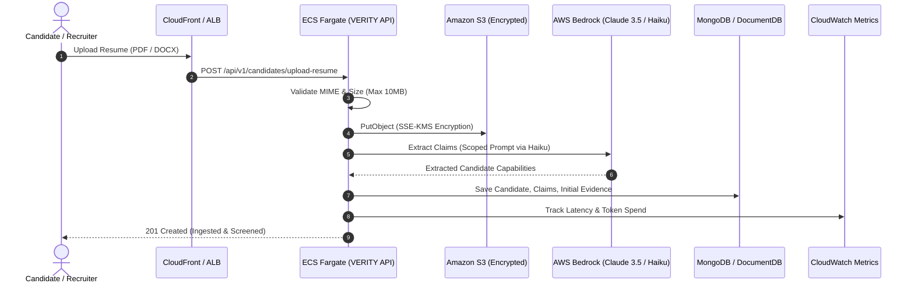

# VERITY ATS — AWS Production Infrastructure Architecture

This document specifies the enterprise cloud architecture for deploying **VERITY** to production on Amazon Web Services (AWS).

---

## 1. Architecture Topology & Component Overview

```
                                  +-------------------------------------------------------+
                                  |                    AWS Cloud (VPC)                   |
                                  |                                                       |
[Candidate / Recruiter Clients]   |   +-----------------------+     +-----------------+  |
              |                   |   | Amazon CloudFront     | --> | Application     |  |
              +===================>   | (TLS 1.3 & Edge WAF)  |     | Load Balancer   |  |
                                  |   +-----------------------+     +--------+--------+  |
                                  |                                          |            |
                                  |                 +------------------------+            |
                                  |                 |                                     |
                                  |                 v                                     |
                                  |   +---------------------------+                       |
                                  |   | ECS Fargate Cluster       |                       |
                                  |   | (Node.js Express + React) |                       |
                                  |   +---+---------+---------+---+                       |
                                  |       |         |         |                           |
                                  +-------|---------|---------|---------------------------+
                                          |         |         |
                  +-----------------------+         |         +-----------------------+
                  |                                 |                                 |
                  v                                 v                                 v
   +------------------------------+  +------------------------------+  +------------------------------+
   | Amazon S3 (Encrypted)        |  | AWS Bedrock                  |  | Amazon SES                   |
   | - Resumes (Private)          |  | - Claude 3.5 Sonnet (Deep)   |  | - Application Status Alerts  |
   | - Candidate Evidence Artifacts| | - Claude 3 Haiku (Light)     |  | - Interview Invitations      |
   | - Pre-signed URLs (15m TTL)  |  | - Token Budgeting & Caching  |  | - Verified Offer Packages    |
   +------------------------------+  +------------------------------+  +------------------------------+
                  |                                 |                                 |
                  v                                 v                                 v
   +------------------------------+  +------------------------------+  +------------------------------+
   | AWS Secrets Manager          |  | Amazon CloudWatch            |  | Amazon ElastiCache / Redis   |
   | - In-Memory Caching (1h TTL) |  | - Structured JSON Logs       |  | - AI Prompt Response Cache  |
   | - DB & JWT Credentials       |  | - Latency & Security Metrics |  | - Session State & Cache      |
   +------------------------------+  +------------------------------+  +------------------------------+
```

---

## 2. AWS Services Justification & Implementation

### 1. Amazon Simple Storage Service (S3)
- **Use Cases**:
  - Encrypted candidate resume documents (`/resumes`)
  - Multi-stage evidence submissions and code execution payloads (`/evidence`)
  - Generated audit exports and capability reports (`/reports`)
- **Security Controls**:
  - Private buckets with Public Access Block enabled.
  - Server-Side Encryption with KMS (`aws:kms` / `AES256`).
  - Pre-signed Upload and Download URLs (15-minute TTL) ensuring direct-to-S3 transfers without proxy bottlenecks.
  - S3 Lifecycle Policies: Transition evidence logs to S3 Glacier after 90 days.
  - Strict MIME type validation (`application/pdf`, `docx`, `txt`, `json`, `png`, `jpg`) and 10MB size limit.

### 2. Amazon Simple Email Service (SES)
- **Use Cases**:
  - Application receipt confirmations
  - Interview panel invites with Google Meet/calendar attachments
  - Adaptive assessment dispatch & completion alerts
  - Formal job offer packages
- **Security & Reliability**:
  - DKIM and SPF verification configured for domain sender reputation.
  - Automatic exponential backoff retry loop with jitter on transient rate limits.
  - Bounce and complaint handling via SES Configuration Sets.

### 3. AWS Secrets Manager
- **Use Cases**:
  - MongoDB Atlas connection strings
  - JWT Access and Refresh Secrets
  - AWS Bedrock and SES API credentials
- **Cost & Performance Optimization**:
  - In-memory TTL caching (1 hour) reduces Secrets Manager API calls by over 99.8%.
  - Local/development fallback to `process.env`.

### 4. Amazon CloudWatch
- **Use Cases**:
  - Structured application JSON logs with correlation IDs (`requestId`, `organizationId`, `userId`).
  - Operational metrics: API response latency percentiles (p50, p95, p99) and HTTP error rates.
  - AI metrics: Input/output token consumption and estimated USD spend per tenant.
  - Security audit events: Authentication failures, forbidden access attempts, token refresh anomalies.
- **Privacy Enforcement**:
  - Centralized redactor strips passwords, tokens, authorization headers, and raw candidate documents before output.

### 5. Amazon Bedrock (AI Foundation Models)
- **Use Cases**:
  - AI Capability Compiler (Phase 3)
  - Adaptive Assessment Engine (Phase 5)
  - AI Interview Probing Engine (Phase 6)
  - Capability Fingerprinting & Growth Modeling (Phase 7)
- **Cost Control Architecture**:
  - **Complexity-Based Routing**: Lightweight tasks (claim classification, keyword extraction) route to **Claude 3 Haiku** ($0.25/1M in) for 90% cost savings; complex architectural deliberation routes to **Claude 3.5 Sonnet** ($3.00/1M in).
  - **Deterministic Caching**: SHA-256 prompt hashing with 24-hour Redis caching eliminates redundant model calls.
  - **Scoped Ingestion**: Candidate profiles are scoped to relevant target capabilities rather than dumping full multi-page resumes.
  - **Budget Enforcers**: Configurable monthly tenant budgets ($500/month default) prevent runaway spend.

---

## 3. Data Flow Architecture



---

## 4. Security & Compliance Architecture

1. **Least-Privilege IAM Policies**:
   - ECS Task Execution Role grants access strictly to specific S3 buckets, Bedrock model ARNs, Secrets Manager secret ARNs, and SES sender identities.
2. **Encryption in Transit & at Rest**:
   - TLS 1.3 enforced at CloudFront and ALB.
   - S3 buckets encrypted with SSE-KMS.
   - DocumentDB / MongoDB Atlas encrypted with AWS KMS storage encryption.
3. **Tenant & Privacy Isolation**:
   - Middleware enforces tenant organization boundaries (`organizationId`).
   - Automated log sanitizer redacts credentials and candidate PII across all stdout and log streams.

---

## 5. Environment Variables Reference

| Variable Name | Required | Default / Example | Purpose |
| :--- | :--- | :--- | :--- |
| `NODE_ENV` | Yes | `production` | Environment runtime flag |
| `PORT` | No | `5000` | Server listening port |
| `AWS_REGION` | Yes | `us-east-1` | AWS infrastructure region |
| `AWS_S3_BUCKET_NAME` | Yes | `verity-ats-production-resumes` | Primary private S3 bucket for resumes |
| `AWS_S3_EVIDENCE_BUCKET_NAME` | No | `verity-ats-candidate-evidence` | S3 bucket for code & interview evidence |
| `AWS_BEDROCK_SONNET_MODEL_ID` | No | `anthropic.claude-3-5-sonnet-20241022-v2:0` | Bedrock model for complex evaluation |
| `AWS_BEDROCK_HAIKU_MODEL_ID` | No | `anthropic.claude-3-haiku-20240307-v1:0` | Bedrock model for fast classification |
| `AWS_SES_FROM_EMAIL` | Yes | `notifications@verity.ai` | Verified SES sender identity |
| `AWS_SECRETS_MANAGER_NAME` | No | `verity/production/app-secrets` | Secret identifier in Secrets Manager |
| `CLOUDWATCH_LOG_GROUP` | No | `/aws/ecs/verity-ats-production` | CloudWatch log group |
| `CLOUDWATCH_NAMESPACE` | No | `VERITY/RecruitmentIntelligence` | CloudWatch metric namespace |
| `MONTHLY_AI_BUDGET_USD` | No | `500.0` | Monthly AI spend threshold |
| `ENABLE_AI_CACHE` | No | `true` | Prompt response caching toggle |

---

## 6. Cost Considerations & Optimization Summary

1. **Bedrock Model Tiering**: Routing classification prompts to Haiku drops per-token ingestion costs from $3.00/1M to $0.25/1M.
2. **Prompt Caching**: Prevents redundant LLM calls when multiple candidates are screened against identical job requisitions.
3. **Secrets Caching**: In-memory 1-hour TTL reduces Secrets Manager API costs to negligible levels.
4. **S3 Lifecycle Rules**: Automatically transitions cold evidence artifacts older than 90 days to Glacier Flexible Retrieval.
